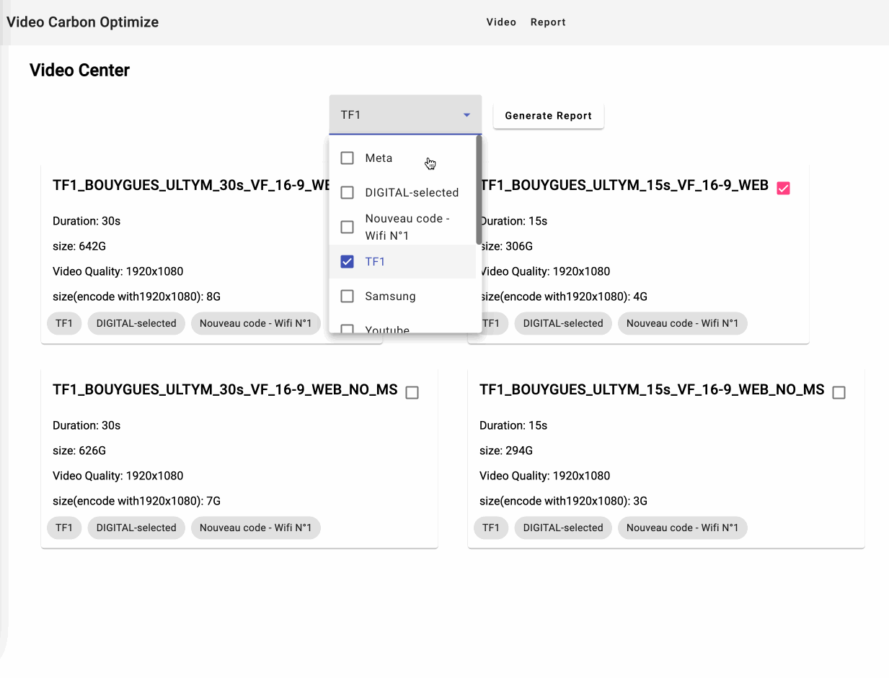

# VideoCarbonReduceReport

## to run app

`npm start` to start nestjs server on port 3000 if other port wanted change it in `.env` file
`npm run dev` to start angular app on port 4200

go to http://localhost:4200

## first version for demo & todos

1. optimize ui
2. add report content
3. optimize performance.
